# Lecture 1: Intro

## Introduction to AI and rational agents

In this course, we define that AI has ability to act rationally.

### Rational

Being rational means acting to maximize your expected utility. We use the <u>expected</u> utility since agents are in the uncertain world.

### The aim of the course

Design a rational agent.

Agent means it is an entity which could be a real robot or a virtual entity.

### Course topics

1. Search & Planning
2. Probability & inference: Avoid expert systems (knowledge based) in the past year.
3. Supervised Learning: Give data and learn from it.
4. Reinforcement Learning: Gain the maximum excepted utility.

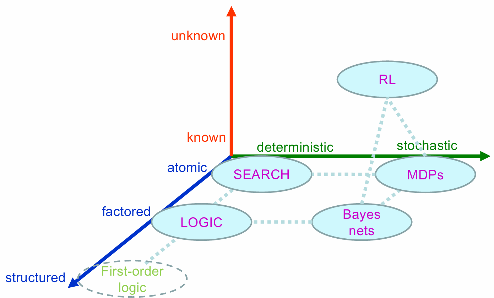

### Agent

Rational agent combines the definition of the rational and agent.

**Reflex agent** is one that doesn’t think about the consequences of its actions, but rather selects an action based solely on the current state of the world (maybe in memory). <u>Reflex agent could be an rational agent sometimes.</u> **(local optimum)**

**Planning agent** must use the model to simulate performing various actions. Then, the agent can determine hypothesized consequences of the actions and can select the best one.

planning vs. replanning:

Planning takes its predefined action to maximum the value based on the environment; Replanning takes a dynamic action based on the variational world.

### PEAS

To define and analysis agent's task environment.  

**Performance Measure**: is a quantitative measure that evaluates the outcomes of an agent’s actions against a predefined goal, which makes AI optimize its action in our expected way.

**Environment**: where the agent acts on and what affects the agent.

**Actuators**: what the agent acts.

**Sensors**: receives information.

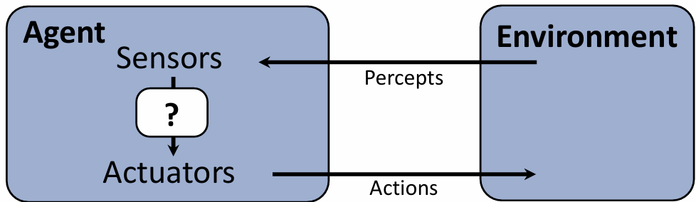

# Lecture 2: Search

## State Spaces, Uninformed Search

Preface of contents: In a Pacman game, Pacman will eat all food with less steps in a maze. To do it, we will create a rational planning agent to complete the task. Thus, it evokes our topics today, *search problem.*

### State Spaces

A search problem consists of the following elements:

- **A state space**: The set of all necessary states information in your given world so that it simplifies the real-world problem. <u>(modelize)</u>
- A successor function (with actions and cost): The road connects two nodes which could exist cost.
- A start state: The state in which an agent exists initially.
- A goal test: A function that takes a state as input, and determines whether it is a goal state.

A <u>solution</u> is a sequence of actions (a plan) which transforms the start state to a goal state.

**State representation:** what a data structure or abstraction will you use to represent the state space? 

**State space size**: For a object in the world space, we often consider it as a static object or mass point in a discrete world. For driving car, you could consider how it could be represented in your navigation apps. In short, <u>what is the relationship between the object with the whole world?</u> 

#### State spaces include world spaces and search space

World space: all possible information in a given environment.

Search space: the necessary information for the task.

​	Example: In a Pacman, we need to acquire information about state spaces, namely agent position, food 	boolean in each state and ghost position.

### State Space Graphs and Search Trees

**State spaces graphs** have the same property as graphs, namely each state (node) occurs once. The edge between two states is an action or a successor function. In the graph, there is a start state and a set of  goal states (goal tests) which maybe not only one. **Weakness:** to large extent, state spaces graphs are rarely constructed due to consuming enormous memory spaces. **Advantage**: graphs are always **completeness** <u>since it records nodes that has visited using **disjoint set**</u> but cannot ensure optimality for all search methods. 

**Search trees** are trees which can convert from state spaces graphs. **Note** that search tree save more memories than state spaces graphs because it never builds a whole tree, only previous nodes and children nodes. However, it may happens to occur repeated structures in a search tree and could revisit the same node again, namely incompleteness.

<u>The content below discussed the tree search.</u>

### Uninformed Search

When we have <u>no knowledge of location of the goal state</u> in the search tree, this kinds of search methods are called an **uninformed search**. 

General trees search has a commonality of fringe and expansion. The exploration strategy distinguishes different search methods namely DFS, BFS and UCS.

**Completeness**: guarantee to find at least one path or plan to the goal test.

**Optimality**: guarantee the path is the shortest way.

##### Premise

Each node has b children nodes. The depth of the tree is m. The target node lies in the s tiers.

#### Depth-First Search (DFS)

It always expands the deepest node at first. This implementation of a fringe strategy is a FILO stack.

**Completeness**

DFS is not a complete method since it would get into an infinite loop when there is a repeat structure occurred.

**Optimality**

No

**Time complexity**

$O(b^m)$ as the total number of node is $1 + b + b^2 + ... + b^m = b^m$, and we can image that the target node lies in the right half tree so that it must go through $b^m/2$. Thus, we can consider that the complexity is $b^m$ if there are no cyclic state spaces.

**Space complexity**

$O(bm)$ as it maintain b nodes at the same time and it needs to go through the depth m of the tree.

#### Breath-First Search (BFS)

It always expands the shallowest node at first. This implementation of a fringe strategy is a FIFO queue.

**Completeness and Optimality**

Yes, but the cost of each action is 1. Whatever BFS is graph search or tree search.

**Time complexity**

$O(b^s)$, the target node lies in the depth s.

**Space complexity**

$O(b^s)$, the whole tier at the last operation.

#### BFS vs. DFS

BFS has an inevitable advantage over DFS except for the space complexity.

#### Iterative Deepening Search

This method combines the advantage of BFS and DFS.

**Idea**: 

- Run DFS with depth limit 1, if no solutions...
- Run DFS with depth limit 2, if no solutions...
- Run DFS with depth limit 3 ...

**Proof**:

Branching factor 10, solution 5 deep:

- BFS: 10 + 100 + 1,000 + 10,000 + 100,000 = 111,110
- IDS:  50 + 400 + 3,000 + 20,000 + 100,000 = 123,450 as the target node lies in at the depth 5 so that the first tier has accessed to 5th times, second one 4th times, ...

#### Uniform Cost Search (UCS)

BFS find **the shortest path** without considered the lowest cost. UCS, in AI community called, is a search method that can find **the least-cost path**, but in theoretical computer science community, it is called the Dijkstra’s algorithm.

It always expands the least cost node at first. This implementation of a fringe strategy is a priority queue.

**Completeness**:

Yes. 

**Optimality**:

Yes, for all costs are greater than 0; If there exists a negative cost, we have to use Bellman-Ford algorithm for a slower way.

**Time complexity:**

$O(b^{C^*/ \varepsilon})$, the optimal path cost as $C^*$, the minimal cost between two nodes in the state space graph as $\varepsilon$, and effective depth is roughly $C^*/ \varepsilon$ which is considered as the tier of tree. The complexity of UCS is similar to BFS.

**Space complexity:**

$O(b^{C^*/ \varepsilon})$

**Reflexion**:

If cost is 1 at each edge, BFS is identical to UCS. The expansion of UCB is every direction. 

# Lecture 3: Search

## Informed Search

UCS is a complete and optimal search method, but it expends in every direction until searching for the goal. What if there is a notion of the goal state? We can improve the performance using *informed search*.

### Heuristics

- A function that estimates how close a state is to a goal.
- Different problems have a particular heuristics function.

Examples: Manhattan distance and Euclidean distance ...

Heuristics are typically solutions to **relaxed problems** (where constraints have been removed such as walls for Pacman). Therefore, **the key of heuristic design is that often uses relaxed problems**

### Greedy Search

It always selects the frontier/fringe node with <u>the lowest heuristic value and ignoring actual costs.</u>

**Completeness and Optimality**

It cannot guarantee to find the goal state or the optimal plan.

​	Example: From a place to another place in the map, direct line distance between two different places is 	the shortest physical distance, but there is a possible that you cannot go through it directly.

### A* Search

This method combines the high speed of greedy search with the completeness and optimality of UCS.

A* search orders by: $f(n) = g(n)+h(n)$ where the sum of path cost (backward cost) -- $g(n)$ and goal proximity (forward cost) -- $h(n)$.

#### Request of A* search:

- <u>Only stop when we dequeue a goal or get out of a goal from queue</u>. It cannot stop when we enqueue a goal or encounter a goal at the queue.
- heuristic cost ≤ actual cost from a current state to a goal, namely <u>underestimate</u> it. It is called admissibility. The <u>wrong figure</u> below.

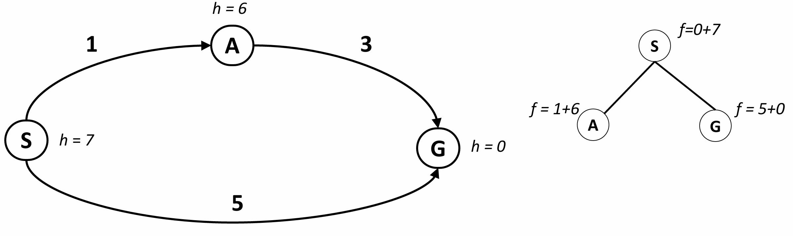

#### Admissibility

A heuristic h is admissible (optimistic) if: $0 \le h(n) \le h^*(n)$ where $h^*(n)$ is the true forward cost to the goal state. <u>If A* search is admissible, then it is optimal even thought the tree has an infinite loop.</u>

#### Graph search

Due to tree search could fall into an infinite loop and revisit nodes, we want to use graphs search. But, for A* search, it evokes the issue that cannot access to the same node as disjoint sets.

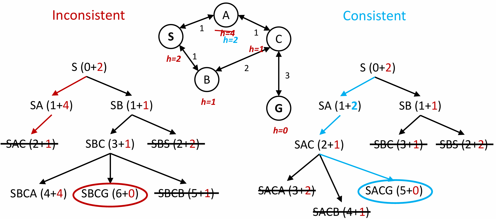

As figure shown above, the final path would not access to the left branch.

##### Consistency

The **consistency** constraints that $h(A)−h(C)≤cost(A,C)$ so that A* graphs search produces an optimality. <u>If the graph is a consistency, then it must be an admissibility.</u>

The consistency leads to a phenomenon: the $f$ value along a path never decreases.

In general, if we design an algorithm from a relaxed problem, most heuristics tends to be admissibility and consistency.

**Weakness of graph search**: It could run out of space.

**Solutions**: 

1. IDA*: like iterative deepening, on each iteration, remember the smallest f-value that exceeds the current limit, use as new limit. However, very inefficient when each f-value is unique.
2. SMA*: construct a queue and when queue is full, drop the maximum f-value of the node but remember its value in the parent.

### Dominance

 $\forall n : h_a(n) ≥ h_b(n)$, we say heuristic a is dominant over heuristic b which implies that *heuristic a much closely estimates the distance to a goal.*

**Trivial heuristic**: is defined as $h(n) = 0$, and using it reduces A* search to UCS.

semi-lattice: 

### Search and Models

Search methods operates over models of the world. Agents try all the plans out in the model world. The *accuracy and performance of search methods relies on the built model.*

# Lecture 4: Search

## Local Search

Pervious search methods are concentrated on the path to the goal state. For local search, it just simply focuses on the goal state rather than the path and solution. For example, the optimal configuration of Sudoku aims to fill the square and the order of filling doesn't matter. 

The state space are sets of "complete" configurations which contains all possible combinations even not satisfying the request. We use these algorithms to try to find a configuration that *satisfies some constraints or optimizes some objective function.* 

In such cases, we can use **iterative improvement algorithms**: keep a single “current” state, try to improve it. This algorithm only needs constant memory space which is suitable to online (calculate as agents move) and offline (calculate ahead) search. *Many machine learning algorithms are local searches.*

### Hill-climbing search

The hill-climbing search algorithm (or steepest-ascent) moves from the current state towards the neighbour state that increases the objective value the most. If no neighbours are better than current one, then quit.

**Issues**: It is vulnerable to being trapped in local maxima and plateaus including flat local maxima and shoulders. At figure below, the final result is 9.

.

**Possible solutions:**

1. Random restart approaches to a complete 
2. Random sideways moves: help us to escape the shoulder but fall into infinite loops at flat local maximum as it's random walk.

### Simulated annealing

Simulated annealing aims to combine random start and hill-climbing to obtain a complete and efficient search algorithm. In simulated annealing, we allow moving to states that can decrease the objective when temperature is pretty high.

**Steps**:

- The algorithm chooses a random restart at each timestep.
- If the move leads to higher objective value, it is always accepted.
- If it leads to a smaller objective value, then the move is accepted with some probability $e^{\Delta E/ T}$. This probability is determined by the temperature parameter, which initially is high (more “bad" moves allowed) and gets decreased according to some “schedule", where ∆E = `next.value - current.value` T is a temperature.

### Local beam search

The algorithm starts with a random initialization of k states at the same time and at each iteration, it takes best on k new states. When it meets some requirements, it terminates the loop.

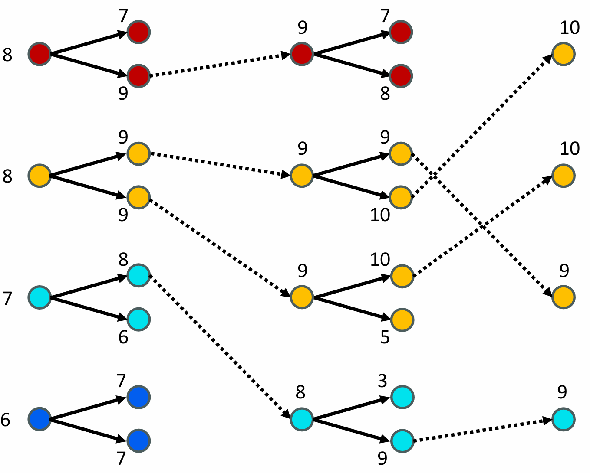

When k = 4. **Note** that local beam search can communicate with each other that it selected the max value among all results using the technique of multi-thread.

### Genetic Algorithms

It is a variant of local beam search and are also extensively used in many optimization tasks. It takes inspiration from evolution.

### Local search in continuous spaces

Example: Place 3 airports in the map. How do we minimize the sum of squared distances from each city to its nearest airport? It could give a *precious location* in the map so that it is called continuous spaces.

**Solutions**:

1. Discretize it!
   - Define a grid with increment d , use any of the discrete algorithms 
2. Choose random perturbations to the state -- random change in the state
   - First-choice hill-climbing: keep trying until something improves the state 
   - Simulated annealing  
3. Compute gradient of $f(x)$ analytically

# Lecture 5: Game

## Trees, Minimax, Pruning

Now that our agents have one or more **adversaries** who attempt to keep against us and reach their utility. We’ll need to run a new set of algorithms that yield solutions to **adversarial search problems**, or called **games**.

**Type of games:**

- Game = task environment with > 1 agent
- Deterministic(depend on yourself) or stochastic(with dices)
- Perfect information (fully observable) or Imperfect information (poker).
- Different amount of players
- Teams or individuals
- Turn-taking or simultaneous
- Zero sum (win or lose). There is a no win-win situation.

As opposed to normal search, which returned a comprehensive **plan**, adversarial search returns a **strategy or policy**, which simply recommends the best possible move to our agent(s) and their adversaries.

**The standard game formulation:** (for deterministic games)

- States: S (start at $s_0$)
- Players: P={1…N} (usually take turns)
- Actions: A (may depend on player/state)
- Transition function: S x A → S
- Terminal test: S → {true, false} (win or lose)
- Terminal utilities: S x P → R (a value could be any.)
- Solution is a policy

### Minimax

The deterministic, and zero-sum-game algorithm is **minimax**, which runs under the motivating assumption that <u>all agents behaves optimally</u>. As a <u>single agent</u>, we can build a *game tree* to illustrate following things.

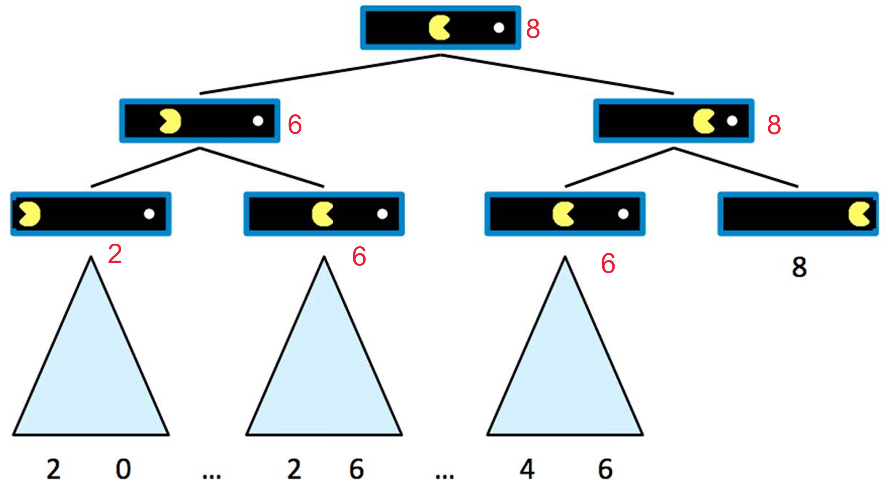

State's value: The best possible outcome (utility) an agent can achieve from that state.

Terminal utilities: The value of a terminal state.

Therefore, the value of non-terminal states depends on their maximum children state's value.
$$
\forall \, \text{non-terminal states}, V(s) = \max\limits_{\substack{s' \in successors(s)}} V(s') \\
\forall \, \text{terminal states}, V(s) = known
$$

For adversarial game trees, calculate the state's value and terminal utilities.  Two agents take turns making moves.

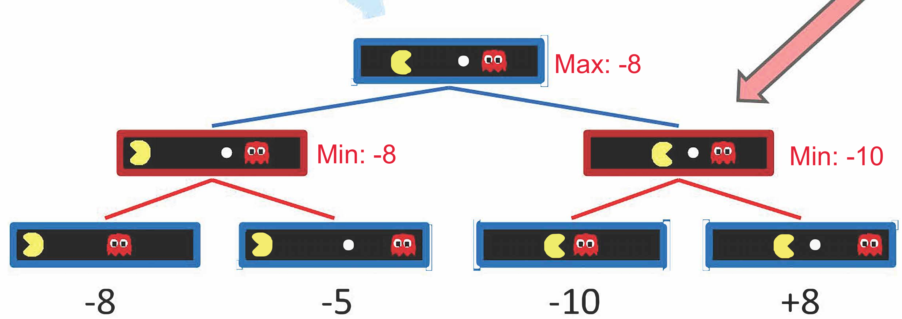

Though Pacman wants the score of $+8$ he can get if he ends up in the rightmost child state, through the minimax algorithm that an optimally-performing ghost will prevent his maximum expected utility. In order to act optimally, Pacman is forced to hedge his bets and counterintuitively move away from the food to minimize the magnitude of his defeat.
$$
\forall \,\text{agent-controlled states}, V(s) = \max\limits_{\substack{s' \in successors(s)}} V(s') \\
\forall \,\text{opponent-controlled states}, V(s) = \min\limits_{\substack{s' \in successors(s)}} V(s') \\
\forall \, \text{terminal states}, V(s) = known
$$
In implementation, minimax is similar to DFS or precisely behaves a **postorder traversal** of the game tree. <u>To build a game game, we can argue that the top state is the current agent state and following states are its estimation of the next adversarial action</u>. Hence, the red state represents pacman infers monster's action and the next blue state represents monster infers pacman action.

In the minimax algorithm, we assume that agents decide the best optimal choice. But, What if adversary makes random choices or makes suboptimal choices? -- Expectimax

#### Multi-Agent Utilities

If the game is not zero-sum, or has multiple players, we would apply <u>generalization of minimax</u> algorithm.

Generalization of minimax:

- Terminals have utility tuples
- Node values are also utility tuples
- Each player **maximizes** its own component
- Can give rise to *cooperation and competition* dynamically

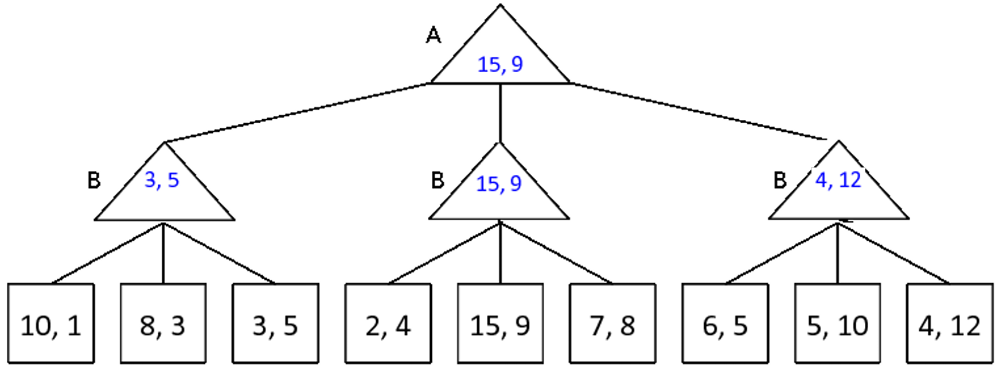

**Note that** it is not a zero-sum we cannot implement prune into multi-agent minimax.

#### Minimax Efficiency

It is similar to DFS so that the time complexity is $O(b^m)$ and space complexity is $O(bm)$, which gives rise to the infeasibility to memorize the whole game steps. We have to use a technique to realize it.

### Alpha-Beta Pruning

To help mitigate this issue, minimax has an optimization called alpha-beta pruning. The upper triangle represents the maximum value and lower triangle is the minimum value.

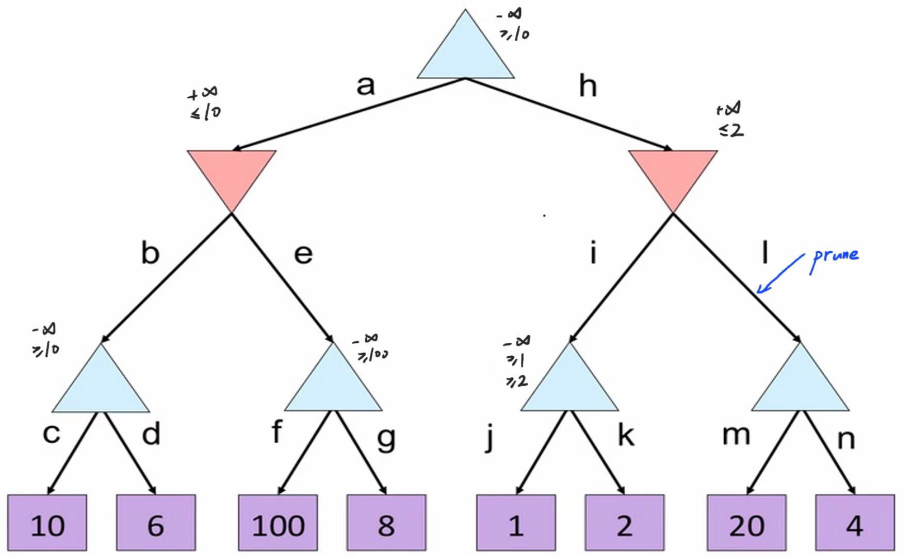

For pruning, it can cut off the max or min children node.

#### Pruning Properties

- This pruning has **no effect** on minimax value computed for the root! 
- Children of the root may have the wrong value! 
  - e.g. Pruning I, it could be fewer values than 2 so the value less than 2 might wrong, but it has no effect on root.
- Good child ordering improves effectiveness of pruning.
- With “perfect ordering”:
  - Time complexity drops to $O(b^{m/2})$, but it is often less than the value in reality.
  - Doubles solvable depth!
  - Full search of, e.g. chess, is still hopeless… 
- This is a simple example of **metareasoning** (computing about what to compute)

### Evaluation Functions

In realistic world, it cannot search from top to the bottom in a tree. We have to turn to **depth-limited minimax** and implement an algorithm -- **iterative deepening** with **evaluation functions** to estimate the values of non-terminal utilities.

However, eval functions cannot guarantee optimal plays. As opposed, it would be offset by diving into multi deeper pilers or layers. The deeper in the tree evaluation function is buried, the less the quality of the evaluation function matters.

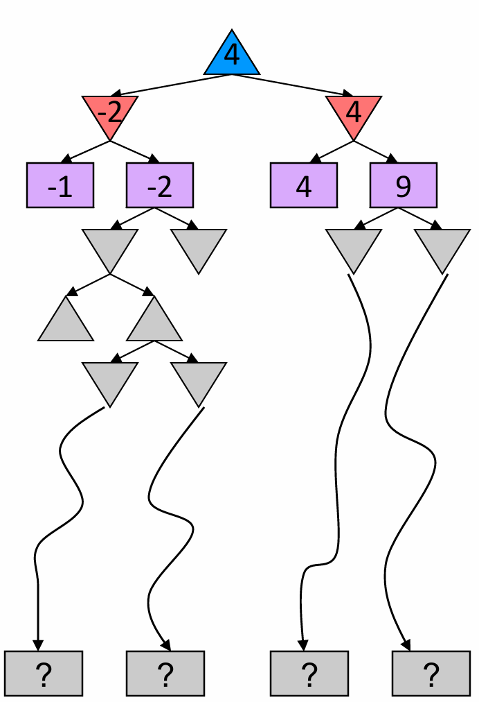

The most common design for an evaluation function is a linear combination of features. 
$$
Eval(s) = w_1f_1(s) + w_2f_2(s) +...+ w_nf_n(s)
$$
where $w$ is the weight and $f_i(s)$ corresponds to a feature extracted from the input state s. E.g., $f_1(s) = \text{(num white queens – num black queens), etc.}$

Or a more complex nonlinear function (e.g., NN) trained by self-play RL.

Be care of replanning agent with an improper evaluation function. In the case, Pacman is willing to eat dots after experiencing a long rough travel, but there are two dots in the maze. So, Pacman would wander between two dots without eating any of them.

### Synergy between Evaluation Function and Alpha-Beta

**Optimize Alpha-Beta pruning**: if we can infer the best optimal choice is at the left side through eval functions, we can expend the left branch first and the most right branches are pruned, whose strategy mitigates the time cost largely.

**Optimize Minimax in Alpha-Beta:** if we can infer that children nodes are all less than the max node by eval functions, we don't need to expend them again.

# Lecture 6: Game

## Expectimax, Monte Carlo Tree Search

### Expectimax

Full minimax allows us to respond optimally against an optimal opponent, but it would be often overly pessimistic in situations which include randomness such as card or dice games or unpredictable opponents that move random or suboptimal choices.

The value for chance nodes should reflect average-case (expectimax)  outcomes, not worst-case (minimax) outcomes. To calculate chance nodes, we compute their expected utility or expected value.

​         $v = \frac{1}{2}\times 8 + \frac{1}{3} \times 24 + \frac{1}{6} \times (-12) = 10$                                       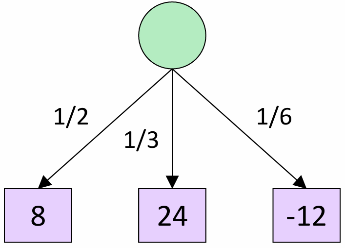

- *Expectimax Pruning:* it could work if we know finite bounds.
- *Depth-Limited Expectimax*: it does work for a depth-limited, but it requires a lot of work to compute.

In general, <u>it is difficult to prune</u> the branch with chance nodes as a single node can fluctuate the expect value. But if we acquire the finite bound of nodes, we could estimate the value.

**Scenario**: your opponent is actually running a depth 2 minimax, using the optimal result 80% of the time, and moving randomly otherwise.

In this case, we should use expectimax as it occurs a probability inside it. But it requires lots of computation resources to simulate opponents' actions in another tree and calculate each node's probability.

### Mixed Layer Types

In previous multi-agents, all agents follows the rule of minimax. If some agents obey minimax and others adhere to expectimax, the result cannot be illustrated with the previous model.

### Monte Carlo Tree Search

For applications with a large branching factor, like playing Go, minimax can no longer be used. For such applications, we use the **Monte Carlo Tree Search (MCTS)** algorithm.

#### MCTS ideas:

- **Evaluation by rollouts**: From state s play many times using a policy (e.g. random or simple heuristics) and count wins / losses. 
- **Selective search:** explore parts of the tree, without constraints on the horizon, that will improve decision at the root.

From a given state, we play until termination according to a policy multiple times. We record the times of wins, which correlates well with the value of the state.

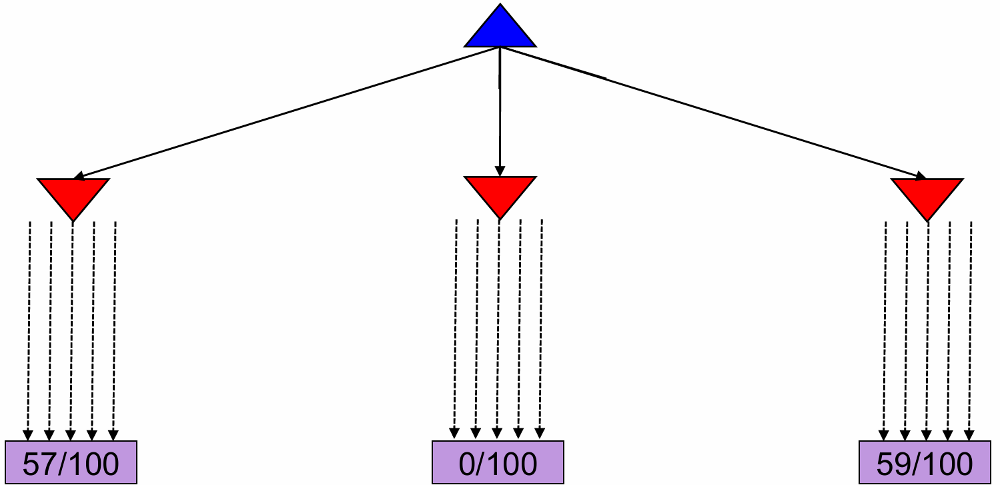

- Allocate rollouts to more **promising** nodes, e.g. contributes more trials to other promising nodes.
- Allocate rollouts to more **uncertain** nodes, e.g. similar values to two nodes.

#### UCB1

The UCB1 algorithm captures this trade-off between “promising" and “uncertain’ actions to determine which nodes should be expended by using the following criterion at each node n:
$$
UCB1(n) = \frac{U(n)}{N(n)} +C \times \sqrt{\frac{logN(PARENT(n))}{ N(n)}}
$$

- N(n) = number of rollouts from node n
- U(n) = total number of wins that went through node n
- The first term captures how promising the node is, while the second captures how uncertain we are about that node’s utility. 
- The user-specified parameter C balances the weight we put in the two terms (“explore new nodes" and “explore nodes we have reached"). 

#### MCTS UCT

The MCTS UCT algorithm uses the UCB criterion in tree search problems.

UCT steps:

1. The UCB criterion is used to move down the layers of a tree from the root node until an unexpanded leaf node is reached. 
2. A new child is added to that leaf, and we run a rollout from that child to determine the number of wins from that node. 
3. We update the numbers of wins from the child back up to the root node.

Once the above three steps are sufficiently repeated, we choose the action that leads to the child with the highest N. Note that because UCT inherently explores more promising children a higher number of times, as $N \rightarrow \infin$, UCT approaches the behaviour of a minimax agent.

# Lecture 7,8,9: Logic

## Propositional Logic and Planning

### Knowledge base

Instead of making agents to learn the world by itself or learn the world by the language, we give some facts about the world and allow it to reason about what to do based on the information at hand. This type of agent is called a **knowledge base agent**. Such agent maintains the knowledge base, which is a set of **logical sentences** in formal language that tells agent some information in the current state. After that, the agent has to make actions based on **inference rule**.

### Logic

The logic specifies how to reason about world and apply inference rule.

#### Contents of logic:

These sentences are expressed according to the specified **syntax**, e.g., x+y=4 is a sentence with a correct syntax.

The **semantics** defines the **truth** of each sentence with respect to each **possible world**. e.g., “x+y=4” is true in a <u>world</u> where x is 2 and y is 2. And it is either true or false in the world.

A **model** is an assignment of true or false to all the **proposition symbols** (the uppercase), which we might think of as a "possible world". 	For example, $A \and B$, then possible models (or "worlds"): {A=true, B=true}...

### Proposition logic

There are two kinds of logic: **proposition logic** and **first-order logic**. 

Propositional logic is written in sentences composed of **proposition symbols** (uppercase), possibly joined by **logical connectives**.

#### Valid, satisfiable, unsatisfiable

Valid: **tautology** -- always true

**Satisfiable**: <u>if there is at least one variable true to make the sentence true</u>, then it is satisfiable. 

Unsatisfiable: **contradiction** -- always false

The satisfiability can solve boolean satisfiability problem (**SAT**), which assigns variable value to make the sentence true.

#### Conjunctive normal form(CNF)

Literals: propositional variables, such as $P\,, \neg P$.

Clause: $(P\and \neg P \or Q )$.

CNF: $(P_1 ∨···∨P_i)∧···∧ (P_j ∨···∨P_n)$: a set of conjunctions between clauses, each of which a set of  disjunctions between literals.

The advantage of CNF is trivial to analyse as the format is well-structured and can integrate database into knowledge base using conjunction. It will be implemented in the DPLL algorithm.

### Propositional Logical Inference

**Entailment**: a|= b (“a entails b” or “b follows from a”) if and only if in every world where a is true, then b must be also true. Or we could say if A|= B then the models of A are a subset of the models of B, $model(A) ⊆model(B)$. e.g., x = 0 entails the sentence $xy = 0$.

The inference problem can be formulated as figuring out whether KB |= q, where KB is our knowledge base  and q is some query. In other words, check whether q is necessarily derived from the knowledge in KB.

Note that Entailment is not identical to the implication as **entailment cannot apply truth-table** to list out all possible values. The axiom below cannot illustrate entailment has a subtle relationship with implication since this conversion just bases on the prove technique itself.

Two useful theorems of entailment:
$$
A |= B \quad \text{iff} \quad A ⇒B \quad \text{is valid}\\
A |= B \quad \text{iff}\quad \neg (A⇒B) \quad \text{is unsatisfiable}\\
A |= B \quad \text{iff}\quad A∧¬B \quad \text{is unsatisfiable}
$$
### Model checking

To proof any algorithm, there are two standards: **soundness** and **completeness**. (Every math methods you learnt conform to two standards.)

> soundness就是说不包含错的结果。
>
> completeness就是说包含所有对的结果。
>
> 举个简单的例子，有一个排序算法，它只有两个输入 list1和list2， list1的正确输出为 list1_sorted， list2的正确输出为list2_sorted。
>
> 假如这个算法输入list1输出list1_sorted，但是输入list2啥也不输出。根据soundness的定义，**因为所有的输出都是正确的**，这个算法是sound的。
>
> 假如这个算法输入list1输出list2_sorted，输入list2输出list1_sorted。根据completeness的定义，**因为输出包含了所有正确的输出**，这个算法是complete的。

To proof entailment (logic), we use **model-checking and theorem-proving**.

Theorem-proving: write down a sequence of proof steps.

Model-checking: list all possible models (finite worlds), and ensure all states are true using truth table. But it has limitation in first-order logic as models are infinite.

If there are N symbols, there are 2N models to check, and the time complexity of this algorithm is $O(2^N)$. Therefore, there are two algorithms to be proposed to terminate it quickly in practice.

#### DPLL

This algorithm is a SAT solver. which apply modification to entailment that reduces it to unsatisfiability $(A |= B \, \text{iff}\, \neg (A⇒B) \, \text{is unsatisfiable})$, and specifically DPLL takes entailment into a problem in CNF.

The acceleration of DPLL lies in three properties: 

**Early termination:** a clause is true when any of variables in clause is true. Hence, we could remove the clause without affecting others; A clause is false, then we could terminate the programme and return false without knowing others.

**Pure symbol heuristic:** A symbol appears only in a **same form** throughout the whole sentence. We could make it true permanently. For example,  $(\neg A∨B)∧(¬B∨C)∧(¬C∨ \neg A)$, all $\neg A$ are in the negative form so we could assign A false to make the whole clause with $\neg A$ true.

**Unit clause heuristic:** A clause with just one literal or a disjunction with one literal and many false. We have to assign it true for satisfying the sentence.

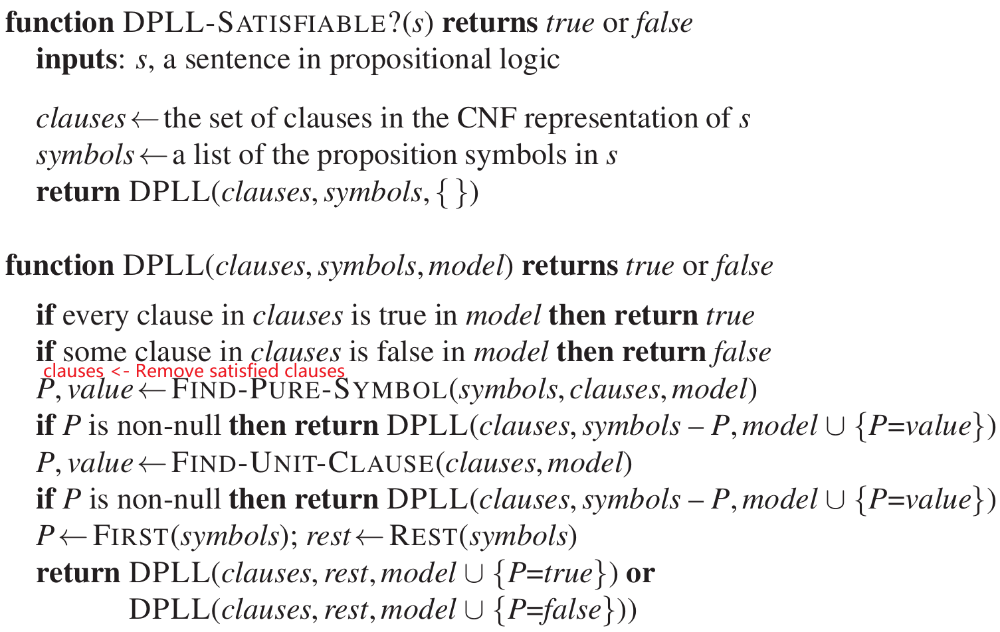

Annotation: The model records the value of variable we have known; symbols would decrease with the iterative process.

With other improvement, the efficiency of DPLL can enhance considerably.

### Theorem proving

An alternate approach is to apply rules of inference to KB to prove that KB |= q. 

#### Forward chain

In forward chain, we mainly use modus ponens, conjunction law to prove entailment. Hence, it requires KB to contain **definite clauses**, which are composed of $(A_1 \and A_2 \and ... \and A_n) \rightarrow$ symbol or a single symbol A.

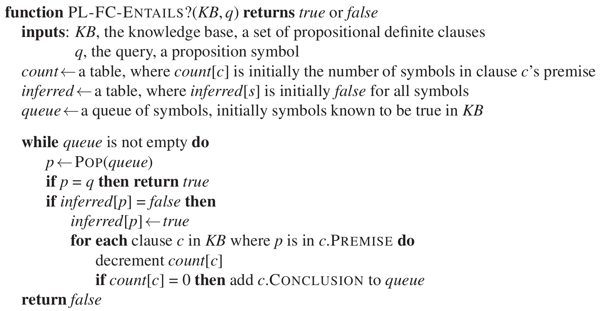

#### Resolution

To show that KB |= α, we show that $(KB∧¬α)$ is unsatisfiable using resolution. The basic idea of resolution is that if $P1,1 ∨P3,1, ¬P1,1 ∨¬P2,2$ is true and we spot that $P1,1$ is complementary, so $P3,1 ∨¬P2,2$. For this algorithm, if two literals are contradiction with each other, then return false.

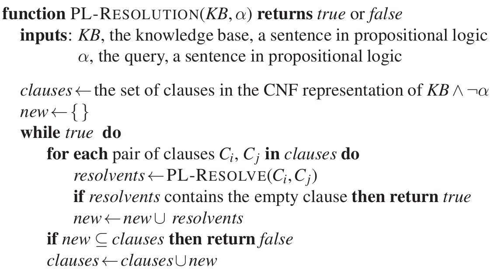

#### Backward chain

Idea: 

- Keep track of what you’re trying to prove
- Look for sentences that might get you there

### Fully observable, deterministic

For a SAT solver, it can make a plan to achieve the goal. But it needs a **fully observable, deterministic** case to satisfy the clause in the KB such as initial place, map, action, goal and transition model.

However, it is not the case that all worlds are observable and deterministic. If the map is already known, the initial place isn't represented. To figure out where the entity is become the key of converting a non-SAT into SAT shortening the time complexity. Natively, agent can implement the current state as an input to deduce where it is whereas this approach would spend tons of time. Hence, the method is the **state estimation** which keeps track of what's true now. But, sometimes we cannot make state estimation accurately and hard to deal with all generated properties in the trace.

To incorporate past observations into an estimate, the agent have a notion of time and transitions between states, which is built from **successor state axioms** that specify how each **fluent** changes. 

$$
F^{t+1} ⇔ActionCausesF^t ∨(F^t ∧¬ActionCausesNotF^t)
$$
where F is a fact that we cache. This sentence can be represented that the fact has happened at the time t+1 if and only if an action causes the fact at time t <u>or</u> the fact has happened and no actions change it at time t.

### First-Order Logic

The second dialect of logic (FOL) is concise and information compared to the propositional logic.

A **term** is something that refers to an  object; It can refer 

1. A constant symbol such as a person.
2. A function symbol with terms as arguments, e.g., BFF(John)
3. A logical variable, e.g., x

Function: Instead of using all constant symbol to represent everything, function helps us to specify the accurate object.

Relation: it will return true or false, e.g., Brothers(...)

Atomic sentences are formed from a predicate symbol(e.g., Brothers) optionally followed by a parenthesized list of terms. e.g., Brothers(John, Tom)

Complex sentences are analogous to propositional logic.

#### Inference of FOL

Method1: converting FOL into propositional logic thought countless models exist.

Method2: substitution.

- KB =  $\forall \, x \, Knows(x,Obama)$.
- Query = $\exists \, y \forall \,x \,Knows(x,y)$.
- Answer = Yes, $.\sigma = {y/Obama}$
- Notation: $a\sigma$ means applying substitution $\sigma$ to sentence a 
  - E.g., if $a= \forall \, x \, Knows(x,y)$ and $\sigma = {y/Obama}$, then $a\sigma = \forall \, x  \, Knows(x,Obama)$ 

Method3: lifted substitution: it directly applies FOL to do inference.

$(∀x HasAbsolutePower(x)∧Person(x)⇒Corrupt(x))∧Person(John)∧HasAbsolutePower(John)$We can directly infer that John has corruption.

### Spectrum of representations

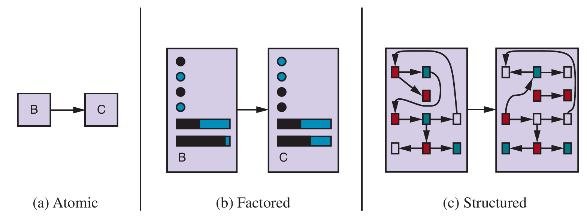

- (a) **Atomic representation**: a state (such as B or C) is a black box with no internal structure. For example, in search problem, each country are considered as a node without any information about country's populations which is called a black box.  Search and game-playing,  hidden Markov models, and Markov decision processes are all work with atomic representations.
- (b) **Factored representation**: a state consists of a vector of attribute values; values can be Boolean, real valued, or one of a fixed set of symbols. In propositional logic, different sentences must **share** the information or variables' value with each other, and each symbol can be represented as 0 or 1 which constructs the form of vector. Constraint satisfaction algorithms, propositional logic, planning, Bayesian networks, and various machine learning algorithms are all based on factored representation.
- (c) **Structured representation:** a state includes objects, each of which may have attributes of its own as well as **relationships** to other objects, not just values. In reality, it isn't possible to modelize all situations. It must occurs some cases beyond our expectation and without existing our KB, which is the shortage of factored representation. To figure out it, we can use natural language to describe an incident with quantifiers. Structured representations underlie relational databases and first-order logic, first-order probability models, and much of natural language understanding.

# Lecture 10: Probability

The real world fills with uncertainty, such as partial observability of world state, noisy sensor and lack of knowledge of world dynamics. Here, we introduce probability.

### Inference by Enumeration

If we have already known the all probability of combination variables and each variable are strictly independence by default, we can derive each probability of variable. The process of acquire all probabilities is called enumeration. 

1. Collect all the rows consistent with the observed evidence variables.
2. Sum out (marginalize) all the hidden variables. $P(Q ,e) =  \sum_h  P(Q , h, e)$
3. Normalize the table so that it is a probability distribution (i.e. values sum to 1) 
   1. Formally, we get the result from this formula $P(Q | e) = P(Q ,e) / P(e)$
   2. Or simply way is just our observation.

# Lecture 11: Bayes Nets

## Bayesian Networks

### Bayesian Network Representation

In reality, it is not possible to construct total independent variables and represent them in a gigantic table. In contrast, it should store a collection of incidents relating to each other which is the **conditional independence**.

X is conditionally independent of Y given Z if and only if:  $x,y,z \quad P(x | y, z) = P(x | z)$.

Bayes nets take advantage of conditional probability and causality in order to avoid representing the entire large joint distribution. Probabilities are instead distributed across a number of smaller **conditional probability tables** (CPT) which is a distribution for child given values of its parents, along with a **directed acyclic graph** (DAG) which captures the relationships between variables.

#### Graphical Model Notation

- **Nodes**: variables (with domains)
  - Can be assigned (observed) or unassigned  (unobserved)
- **Arcs**: some relations, <u>not necessary causal relation so the arrow.</u>
  - Indicate “direct influence” between variables
  - Formally: absence of arc encodes conditional independence (more later)

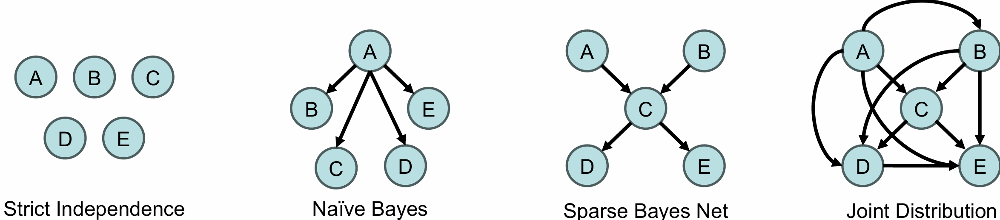

##### Example

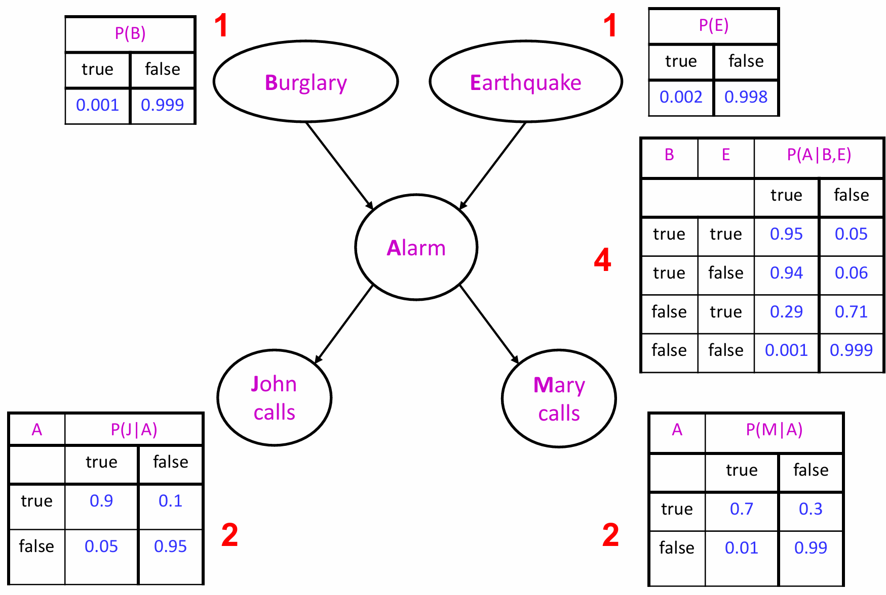

There is a Sparse Bayes Net model consisting of five binary random variables which are B: Burglary, E: Earthquake, A: Alarm goes off, J: John calls and M: Mary calls.

In this Bayes Net, we would store probability tables $P(B),P(E),P(A|B,E),P(J|A), \text{and } P(M|A)$.

### Conditional independence

Semantics: <u>Every variable is conditionally independent of its non-descendants given its parents.</u> In other word, except for parents and their child, other nodes has conditional independence.

Given all of the CPTs for a graph, we can calculate the probability of a given assignment using the following rule:
$$
P(X_1,X_2,...,X_n) = ∏^{n}_{i=1} P(X_i|(parents(X_i), Ancestors(X_i))\\
\text{By semantics, } \quad
P(X_1,X_2,...,X_n) = ∏^{n}_{i=1} P(X_i|parents(X_i))
$$
For example, $P(−b,−e,+a,+j,−m)=P(−b)·P(−e)·P(+a|−b,−e)·P(+j|+a)·P(−m|+a)$.

### Efficiency

For enumeration, there are $d^n$ if it exits N variables, each with d values. For CPT, it needs $N * d^k$ if it exists  an N-node net and a node has at most k parents. Both give you the power to calculate $P(X_1, X_2, …, X_N)$. Whereas Bayes Nets have properties of huge space savings with sparsity, easier to elicit local CPTs and faster to answer queries.

Models attempt to capture the way the world works, but because they are always a simplification they are always wrong. However, with good <u>trade-off choices of memory saving and accuracy</u> they can still be good enough approximations that they are useful for solving real problems in the real world.

# Lecture 12: Bays Nets

## Inference

### Inference in Bayes Net

Given a Bayes Net, we can gain any value naively by forming the joint PDF and using Inference by Enumeration. This requires the creation of and iteration over an exponentially large table. 

For example, 
$$
\begin{equation*}
  \begin{aligned}
    P(B |+j,+m) &=\sum_{e, a} P(B,e,a,+j,+m) \\
    &= \sum_{e, a} P(B)P(e)P(a|B,e)P(+j|a)P(+m|a)\\
&=P(B)P(+e)P(+a|B,+e)P(+j|+a)P(+m|+a)\\
&+P(B)P(+e)P( a|B,+e)P(+j| a)P(+m| a) \\
&+P(B)P(-e)P(+a|B, -e)P(+j|+a)P(+m|+a)\\
&+P(B)P(-e)P(-a|B,-e)P(+j| a)P(+m|-a)\\
  \end{aligned}
\end{equation*}
$$
By observation, the equation is filled in lots of repeated subexpressions.

### Variable Elimination

The basic idea: Move summations inwards as far as possible and do calculation from inside to outside.

$P(B | j, m) =  α \sum_{e, a}P(B) P(e) P(a|B,e) P(j|a) P(m|a) = α P(B) \sum_{e} P(e)\sum_{a}P(a|B,e) P(j|a) P(m|a)$.

Procedure: join all factors, eliminate all hidden variables and normalize.

Operation1: r leads to t so  $\forall r, t \quad P(r,t) = P(r)\, P(t|r)$.

Operation2: Take a factor and sum out a variable as we process.

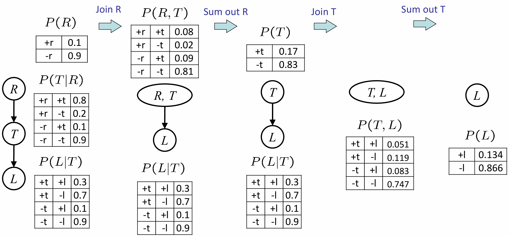

If it has an evidence or only calculates some situation, we can formulate it with a signed value.

Operation3: normalization. 

#### Example:

By observing D, we can summarize that <u>any leaf can be removed if it is not a query variable or an evidence variable</u>. Besides, <u>the order of elimination</u> is matter. According to the sequence of figure, it largely avoids storing more than 2 variables in a table.

### Order

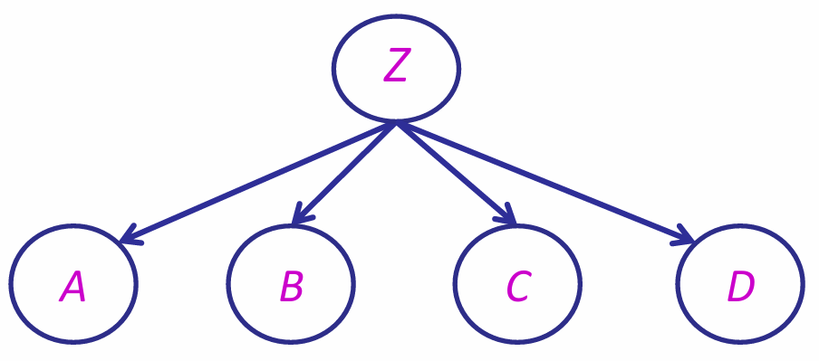

- Order the terms Z, A, B C, D
  - $P(D) =  α \sum_{z,a,b,c}P(z) P(a|z) P(b|z) P(c|z) P(D|z)=  α \sum_{z} P(z) \sum_{a} P(a|z) \sum_{b} P(b|z) \sum_{c} P(c|z) P(D|z)$
  - Largest factor has 2 variables (D,Z) 
- Order the terms A, B C, D, Z
  - $P(D) =  α \sum_{a,b,c,z}P(a|z) P(b|z) P(c|z) P(D|z) P(z)=  α \sum_{a} \sum_{b} \sum_{c} \sum_{z} P(a|z) P(b|z) P(c|z) P(D|z) P(z)$ 
  - Largest factor has 4 variables (A,B,C,D)

### SAT & Complexity

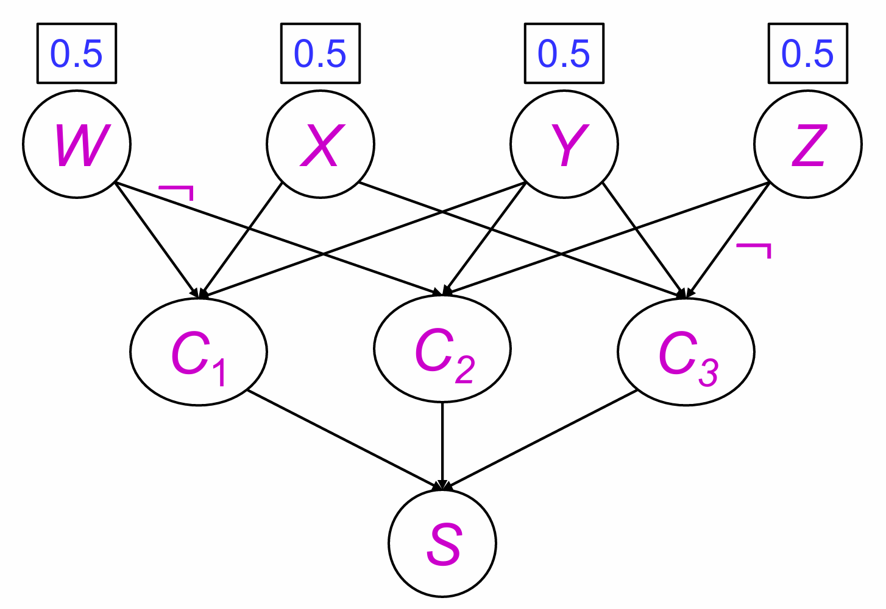

CNF clauses: $C_1= W\or X\or Y$， $C_2= Y\or Z \or ¬W$, $C_3= X\or Y \or ¬Z$. Sentence S = $C_1\or C_2\or C_3$. So, we can figure out P(S) > 0 iff S is satisfiable. However, in the worst case, the complexity still reaches $2^n$.

It is still possible to simplify the part of case that approaches to linear time with proper methods. For **poly-trees**, a directed graph with no undirected cycles, the complexity of  variable elimination is linear in the network size if you eliminate from the leaves towards the roots. And if the graph processes a circle, we could separate the tree into two which discusses two situation respectively.

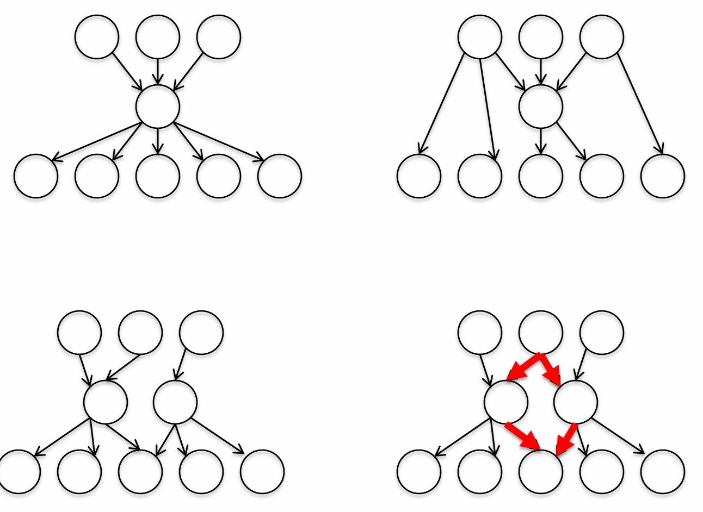

# Lecture 13: Bays Nets

## Sampling

An alternate approach for probabilistic reasoning is to implicitly calculate the probabilities for our query by simply **counting samples**. This will not yield the exact solution, as in Inference By Enumeration or Variable Elimination, but this **approximate inference** is often <u>good when only considering saving memory spaces and computation steps.</u>

**Basic step:** Draw N samples from a **sampling distribution S**. Compute an approximate posterior probability.

### Sampling in Bays Net

#### Prior sampling

It leverages the basic step above, selects the excepted data and do probability. Besides, we can conclude that with the drawing sample getting larger the probability we get is approaching to the exact probability.

#### Rejection sampling

For calculating the $P(C| r, w)$, samples with $¬r$ or $¬w$ are not relevant. So count the C outcomes for samples with r, w and reject all other samples as long as they appear. It is called the rejection sampling.

#### Likelihood sampling

If the frequency of r, w are considerably few, the algorithm above would reject amount of evidences. To fix that, we force some variables to be equal to the evidence. However, our samples occur with probability only equal to the products of the CPTs of the non-evidence variables. In order to calculate states given some conditions, we assign them **weights** to avoid counting them equally.  

Samples weights: $w(z,e) = \prod_k P(e_k | parents(E_k))$.

##### Example

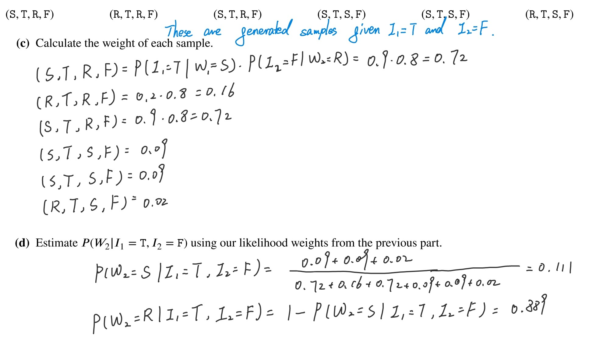

##### Weakness

<u>The values of upstream variables are unaffected by downstream evidence</u>, which implies that compute the f probability given the end of e node. f node has a giant difference value so it takes tons of time to get the opposed value. Therefore, in the best case, given value should be the **forefront** of trees.

#### Gibbs sampling

##### Markov Chain Monte Carlo

MCMC (Markov chain Monte Carlo) is a family of randomized algorithms for approximating some quantity of interest over a very large state space. Markov chain is a sequence of randomly chosen states (“random walk”),  where each state is chosen conditioned on the previous state. The Monte Carlo Method is a broad class of computational algorithms that rely on repeated random sampling to obtain numerical results(不断抽样、逐渐逼近).

##### Gibbs sampling

Gibbs sampling is a kind of MCMC.

 A variable’s Markov blanket consists of parents, children, children’s other parents.

Repeat many time and sample a non-evidence variable $X_i$ from:

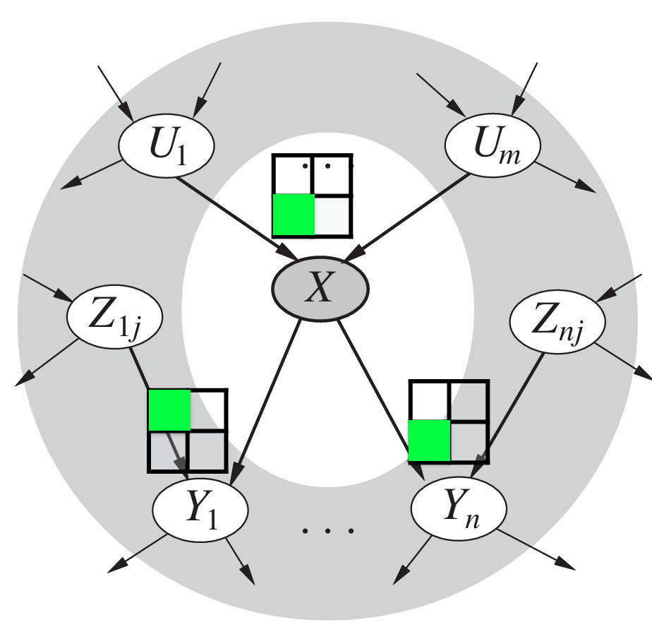

$P(X_i | x_1,..,x_{i-1},x_{i+1},..,x_n) = P(X_i | \text{markov blanket}(X_i)) =   α P(X_i | parents (X_i))\prod_j P(y_j| parents(Y_j))$

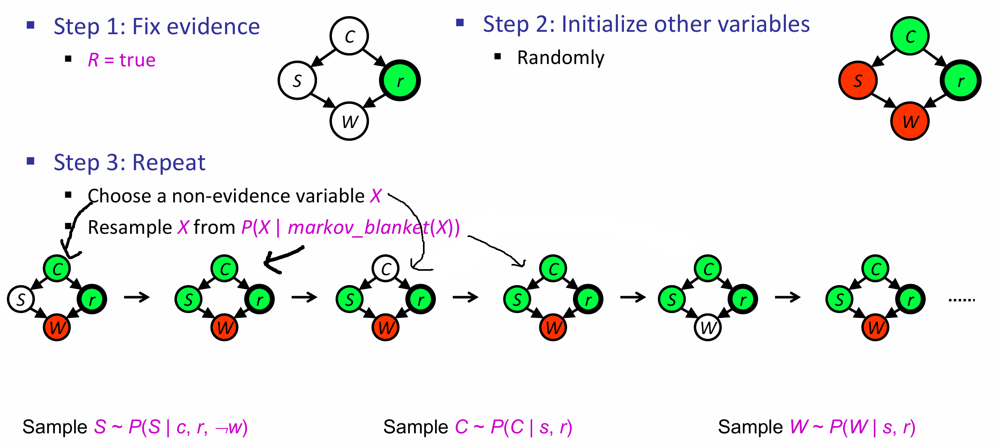

**The efficiency of resampling a single variable:** 
$$
P(S | +c, +r, -w) = \frac{P(S, +c, +r, -w)}{P(+c, +r, -w)} = \frac{P(S, +c, +r, -w)}{\sum_s P(s, +c, +r, -w)} \\
= \frac{P(+c)P(+r|+c)P(S|+c)P(-w|S, +c)}{\sum_s P(+c)P(+r|+c)P(s|+c)P(-w|s, +c)} = \frac{P(+c)P(+r|+c)P(S|+c)P(-w|S, +c)}{ P(+c)P(+r|+c)\sum_s P(s|+c)P(-w|s, +c)}\\
= \frac{P(S|+c)P(-w|S, +c)}{\sum_s P(s|+c)P(-w|s, +c)}
$$
Summary: only CPTs that have resampled variable need to be considered, and joined together.

# Lecture 14: HMMs

## Markov Chains, HMMs

The state of the underlying system is changing with time or is dynamic. Rather than it is static as Bays Nets. So we model with those changes to build Markov chains.

### Markov Models

Markov models, analogous to a chain-like and infinite-length Bayes’ net, are also called Markov chain or Markov process, whose basic idea is **“future is independent of the past given the present"**, namely  $X_{t+1}$ is independent of $X_0,…, X_{t-1}$ given $X_t$. Its property shows the first order Markov models as opposed to the kth order Markov models which relays on k earlier steps. To track how the relation of $X_{t+1}$ and $X_t$,  the **transition model** $P(X_t | X_{t-1})$ specifies how the state evolves over time. 
$$
P(W_0,W_1,...,W_n) = P(W_0)P(W_1|W_0)...P(W_n|W_{n−1}) = P(W_0) ∏_{i=0}^{n−1}P(W_{i+1}|W_i)
$$
A final assumption is that the transition model is **stationary**. In other words, for all timesteps $i$, $P(W_{i+1}|W_i)$ is identical, which simplifies models into two tables: $P(W_0)$ and $P(W_{i+1}|W_i)$ saving memory space compared to Bays Nets.

#### The Mini-Forward Algorithm

Now, to calculate P(W_{i+1}), we can implement the previous inefficient technique of marginalization. Instead, we’ll present a more efficient technique called the mini-forward algorithm.
$$
P(W_{i+1}) = ∑_{w_i} P(w_i,W_{i+1}) = ∑_{w_i} P(W_{i+1}|w_i)P(w_i)
$$
$P(W_{i+1}|w_i$) is the transition model and $P(w_i)$ is previous state.

With this equation, we can *recursively* compute the distribution at any timestep by starting with our initial distribution $P(W_0)$ and using it to compute $P(W_1)$, then in turn using $P(W_1)$ to compute $P(W_2)$, and so on.

#### Stationary Distribution

The probability of being in a state would converge at a given timestep, which satisfied $P_{\infty}=P_{\infty +1}= T^T P_{\infty}$ where T is transpose of transition matrix only suitable in this question.

For example, 

​          $\begin{pmatrix} 0.9 & 0.3 \\ 0.1 & 0.7 \end{pmatrix}\begin{pmatrix} p \\ 1-p \end{pmatrix} = \begin{pmatrix} p \\ 1-p \end{pmatrix} $                                   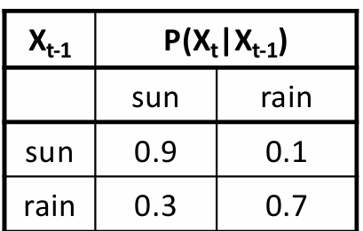

The 2 by 2 matrix makes a transposition.

### Hidden Markov Models

Unlike normal Markov models that can observe the current state to predict the future, in hidden Markov Models the true state is not observed directly but evidence variables can be shown. In HMM, we’ll call each $W_i$ a state variable and each weather forecast $F_i$ an evidence variable. 

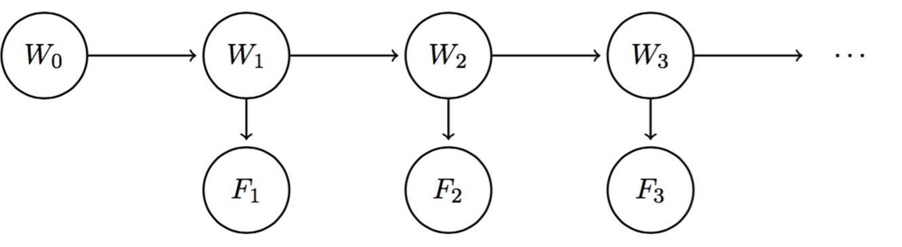

- Future states are independent of the past given the present, namely $W_{t+1}$ is independent of $W_0,…, W_{t-1}, F_0, ..., F_{t-1}$ given $W_t$. 
- Current evidence is independent of everything else given the current state, i.e., $F_{t}$ is independent of $W_0,…, W_{t-1}, F_0, ..., F_{t-1}$ given $W_t$. 

Hidden Markov Models make the assumption that the **transition model** $P(W_{i+1}|W_i)$ is **stationary** and the **sensor model** $P(F_i|W_i)$ is **stationary** as well.

#### Inference task

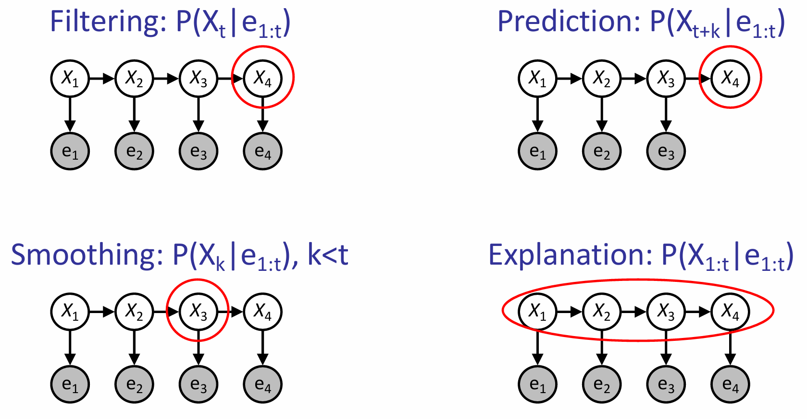

- Filtering: $P(X_t|e_{1:t})$
  - Belief state refers to the accurate estimation given the current environment.
- Prediction: $P(X_{t+k}|e_{1:t})$ for k > 0
- Smoothing: $P(X_k|e_{1:t})$ for 0 ≤ k < t
  - It is better estimate of past states, essential for learning
- Most likely explanation: $\text{arg max}_{x_{1:t}} P(x_{1:t} | e_{1:t})$ 
  - E.G., speech recognition, decoding with a noisy channel 

#### Filtering

The **forward algorithm** solving filtering can be thought of as consisting of two distinctive steps: the **time elapse update** which corresponds to determining $B'(W_{i+1})$ from $B(W_i)$ and the **observation update** which corresponds to determining $B(W_{i+1})$ from $B'(W_{i+1})$. 

To compute the **belief distribution** $B(W_{i+1}) =P(W_{i+1}|f_1,..., f_{i+1})$, we first update time elapse $B'(W_{i+1})$:
$$
\begin{equation*}
  \begin{aligned}
    B'(W_{i+1}) &= P(W_{i+1}|f_1,..., f_i)\\
    &= \sum_{w_i}P(W_{i+1},w_i|f_1,..., f_i) \\
    &= \sum_{w_i}P(W_{i+1},w_i|f_1,..., f_i) \\
    &= \sum_{w_i}P(W_{i+1}|w_i, f_1,..., f_i)P(w_i|f_1,..., f_i)\\
    &= \sum_{w_i}P(W_{i+1}|w_i)B(w_i)\\
  \end{aligned}
\end{equation*}
$$
This equation can be considered as a min-forward algorithm so it updates the time elapse.

Now, we would think of the relationship between $B(W_{i+1})$ and $B'(W_{i+1})$.

$$
\begin{equation*}
  \begin{aligned}
    B(W_{i+1}) &=P(W_{i+1}|f_1,..., f_{i+1}) \\
      &= \frac{P(W_{i+1}, f_{i+1}|f_1,..., f_i)}{ P(f_{i+1}|f_1,..., f_i)}\quad \text{delay normalization} \\
      &= \alpha \, P(W_{i+1}, f_{i+1}|f_1,..., f_i)\\
      &= \alpha \, P(f_{i+1}|W_{i+1}, f_1,..., f_i)B'(W_{i+1})\\
      &= \alpha \, P(f_{i+1}|W_{i+1})B'(W_{i+1})\\
      &= \alpha \, P(f_{i+1}|W_{i+1}) \sum_{w_i}P(W_{i+1}|w_i)B(w_i) \\
  \end{aligned}
\end{equation*}
$$
We’ve just derived yields an recursive algorithm known as the **forward algorithm**, the Hidden Markov Model analogy of the mini-forward algorithm from earlier.

#### Most likely explanation

Now, we want to find the **most possible path** given a sequence of evidences. This can be solved by **Viterbi algorithm**.

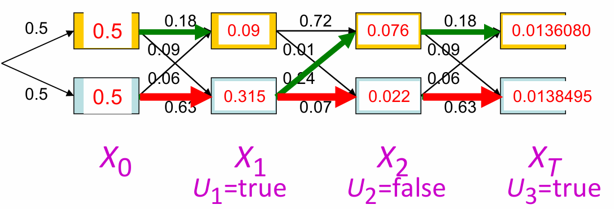                                           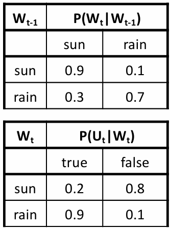

Given state trellis, graph of states and transitions over time, each arc represents some transition $x_{t-1} \rightarrow x_t$ and the product of weight in each arc is $P(x_t | x_{t-1}) P(e_t |x_t)$. 

To calculate the highest probability in each node and select the best path.
$$
\begin{equation*}
  \begin{aligned}
    &\text{arg max}_{x_{1:t}} P(x_{1:t} | e_{1:t})\\
    =& \text{arg max}_{x_{1:t}}\,\alpha\, P(x_{1:t}, e_{1:t})\\
    =& \text{arg max}_{x_{1:t}}\, P(x_{1:t}, e_{1:t}) \text{ only for path}\\
    =& \text{arg max}_{x_{1:t}}\,P(x_0) ∏_t P(x_t | x_{t-1}) P(e_t |x_t)\\
    =& \text{arg max}_{x_{1:t}} \log \left[ P(x_0) \prod_t P(x_t \mid x_{t-1}) P(e_t \mid x_t) \right] \\
=& \text{arg max}_{x_{1:t}} \log P(x_0) + \sum_t \log P(x_t \mid x_{t-1}) + \log P(e_t \mid x_t)
  \end{aligned}
\end{equation*}
$$
Here, we modify the equation into logarithm in order to avoid numerical underflows as the probability values are usually very small approaching to 0.

The difference between Forward algorithm and Viterbi algorithm: Forward algorithm computes sums of paths, Viterbi algorithm computes best paths.

# Lecture 15

## Dynamic Bays Nets & Particle Filtering

### Dynamic Bays Nets

DBNs track multiple variables along with time and multiple sources of evidence which indicates hidden variables. Hence, it combines characters of HMM and Bays Nets.

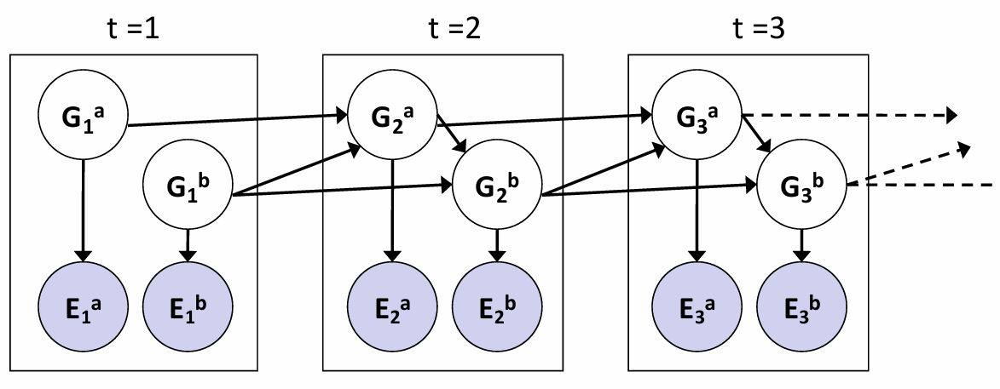

Every HMM is a single-variable DBN. Every discrete DBN is an HMM.

The method of solving DBNs is Variable elimination, whose categories can be divided into two--online or offline. For offline: “unroll” the network for T time steps, then eliminate variables to find $P(X_T|e_{1:T})$. For online, eliminate all variables from the previous time step; store factors for current time only. However, if single factor contains all variables for current variable, it is still difficult to calculate much less offline.

### Particle filtering

Particle filtering involves *simulating the motion of a set of **particles*** through a state graph to approximate the probability (belief) distribution of the random variable in question. This solves the same question as the Forward Algorithm: it gives us an approximation of $P(X_N|e_{1:N})$.

It stores a list of $n$ particles where each particle is in one of the $d$ possible states. Typically, $n$ is significantly *smaller* than $d$ ($n << d$) but still large enough to yield meaningful approximations.

#### Process

Once we’ve sampled an initial list of particles, the simulation takes on a similar form to the forward algorithm, with a **time elapse update** followed by **an observation update** at each timestep:

- *Time Elapse Update*: **Update the value** of each particle according to the transition model $P(T_{i+1}|t_i)$.
- *Observation Update*: the process of **adjusting particle weights** based on the sensor model $P(F_i|T_i)$ and the observed data.  The algorithm for the observation update is as follows:
  1. Calculate the weights of all particles as described above. 
  2. Calculate the total weight for each state. 
  3. If the sum of all weights across all states is 0, reinitialize all particles. 
  4. Else, normalize the distribution of total weights over states and resample your list of particles from this distribution.

